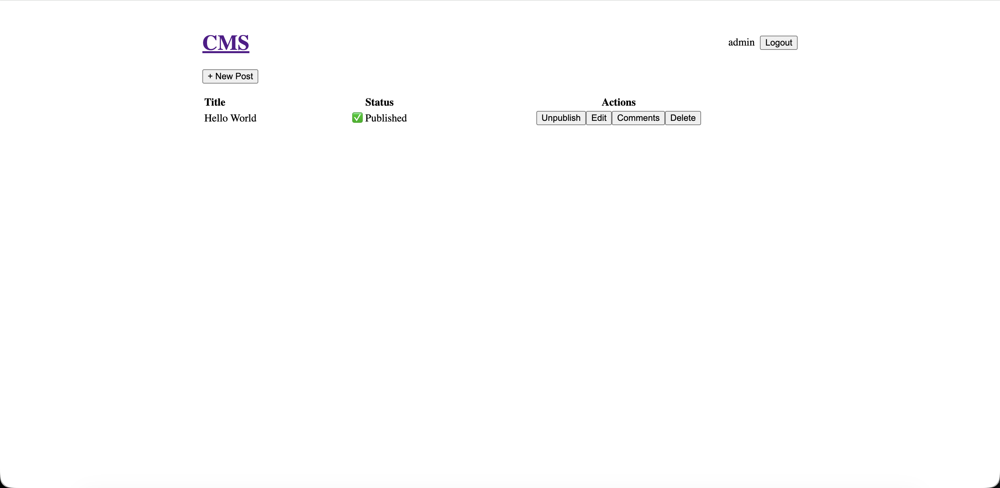
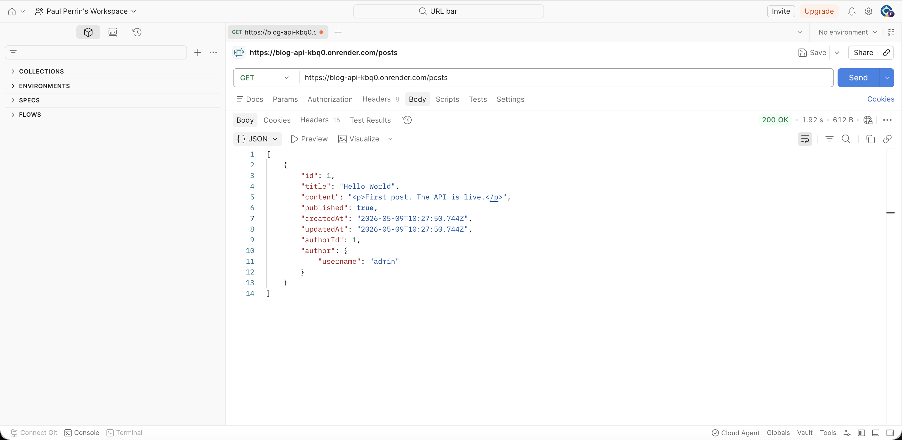

# Blog API

A REST API with a public reader and author CMS. Built as a Node.js project for The Odin Project.

## Live

| App | URL |
|-----|-----|
| API | https://blog-api-kbq0.onrender.com |
| Reader | https://blog-api-sigma-ten.vercel.app |
| CMS | https://blog-api-cms-three.vercel.app |

> First request to the API may take 30s to wake from sleep (free tier).

## Screenshots





## Stack

**Backend:** Node.js · Express · Prisma · PostgreSQL (Neon) · JWT · Passport.js · bcrypt  
**Frontend:** React 19 · Vite · React Router v7 · TinyMCE

## Structure
blog-api/
├── api/      # Express REST API
├── reader/   # Public blog reader (React)
└── cms/      # Author dashboard (React + TinyMCE)

## API Endpoints

### Auth
| Method | Path | Auth | Description |
|--------|------|------|-------------|
| POST | /auth/signup | — | Create account |
| POST | /auth/login | — | Returns JWT token |

### Posts
| Method | Path | Auth | Description |
|--------|------|------|-------------|
| GET | /posts | — | All published posts |
| GET | /posts/:id | — | Single post with comments |
| POST | /posts | Author | Create post |
| PUT | /posts/:id | Author | Update post |
| DELETE | /posts/:id | Author | Delete post |

### Comments
| Method | Path | Auth | Description |
|--------|------|------|-------------|
| GET | /posts/:id/comments | — | All comments |
| POST | /posts/:id/comments | User | Add comment |
| DELETE | /posts/:id/comments/:id | Author | Delete comment |

## Test credentials
username: admin
password: password

## Run locally

```bash
git clone https://github.com/paulperrin-stack/blog-api
cd blog-api/api
cp .env.example .env
npm install
npx prisma migrate dev
npx prisma db seed
npm run dev
```